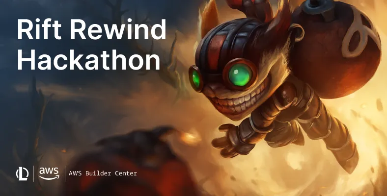
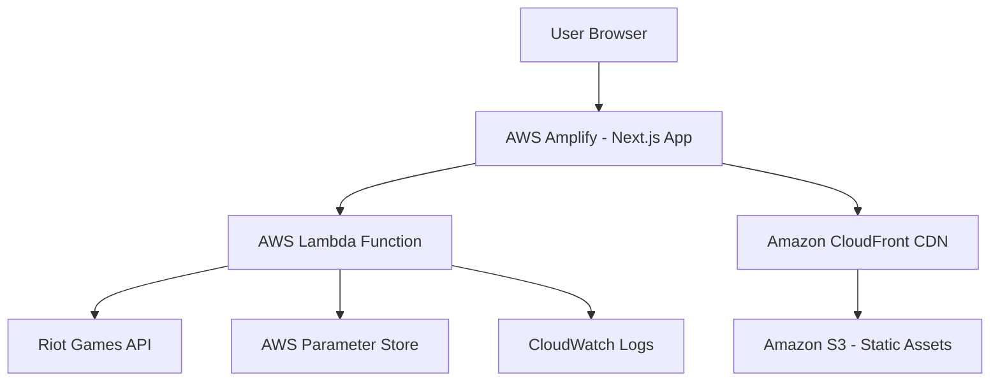
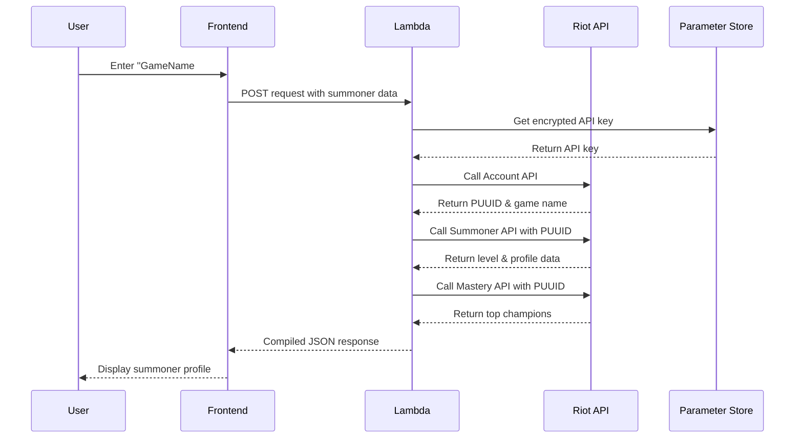

<a name="readme-top"></a>

# 🚀 Space Portfolio - League of Legends Integration

<div align="center">



_A modern space-themed developer portfolio with integrated League of Legends summoner lookup_

[](https://www.vaishnavidev.tech)
[](https://aws.amazon.com/amplify/)
[](https://developer.riotgames.com/)
[](https://nextjs.org/)

</div>

---

## � Overview

This **space-themed developer portfolio** combines personal showcase elements with an interactive **League of Legends summoner lookup tool**. Built with Next.js 14 and deployed on AWS, it demonstrates modern serverless architecture while providing an immersive gaming-meets-development experience.

### ✨ Key Highlights

- 🎨 **Interactive Space Theme** - Animated starfields, cosmic effects, and nebula gradients
- 🎮 **Live Riot API Integration** - Real-time summoner lookup and champion mastery data
- ⚡ **Serverless Architecture** - AWS Lambda, Amplify, and Parameter Store
- 🌍 **Global Performance** - CloudFront CDN for worldwide speed
- 📱 **Responsive Design** - Optimized for desktop, tablet, and mobile
- 🔒 **Secure API Management** - Encrypted key storage with AWS Parameter Store

---

## 🔧 AWS Services Used

| Service             | Purpose                     | Free Tier Limit                  |
| ------------------- | --------------------------- | -------------------------------- |
| **AWS Amplify**     | Static site hosting + CI/CD | 1,000 build minutes/month        |
| **AWS Lambda**      | Serverless API proxy        | 1M requests + 400,000 GB-seconds |
| **Parameter Store** | Secure API key storage      | 10,000 parameters                |
| **CloudFront**      | Global CDN                  | 1TB data transfer out            |
| **S3**              | Static asset storage        | 5GB storage                      |
| **CloudWatch**      | Monitoring & logs           | 5GB logs ingestion               |

---

## 🏗️ Architecture



## ✨ Key Features

### 🎨 **Space Theme Design**

- **Three.js Integration**: Interactive 3D starfield backgrounds
- **Framer Motion Animations**: Smooth transitions and hover effects
- **Cosmic Color Palette**: Deep space blues, nebula purples, and stellar gold
- **Particle Systems**: Dynamic floating particles and constellation patterns

### 🎮 **League of Legends Integration**

- **Real-time Summoner Lookup**: Search by Riot ID (GameName#TagLine)
- **Champion Mastery Display**: Top 3 champions with detailed stats
- **Cross-Region Support**: NA, EU, KR, Asia, and more
- **Live Player Data**: Current level, profile icons, and achievement tracking
- **Smart Error Handling**: User-friendly messages for invalid searches

### ⚡ **Performance Features**

- **Server-Side Rendering**: Next.js 14 with optimized loading
- **Global CDN**: CloudFront distribution for worldwide speed
- **Lazy Loading**: Components load as needed for better performance
- **Responsive Images**: Optimized assets for all device sizes

## 📁 Project Structure

```
space-portfolio/
├── 📁 app/
│   ├── favicon.ico
│   ├── globals.css
│   ├── layout.tsx
│   └── page.tsx
├── 📁 components/
│   ├── 📁 main/
│   │   ├── contact.tsx              # Contact form + LoL lookup
│   │   ├── encryption.tsx           # Animated encryption effect
│   │   ├── footer.tsx              # Footer component
│   │   ├── hero.tsx                # Hero section with 3D background
│   │   ├── league-lookup.tsx       # League of Legends integration
│   │   ├── navbar.tsx              # Navigation bar
│   │   ├── projects.tsx            # Projects showcase
│   │   ├── skills.tsx              # Skills section
│   │   └── star-background.tsx     # Animated space background
│   └── 📁 sub/
│       ├── hero-content.tsx        # Hero section content
│       ├── project-card.tsx        # Individual project cards
│       ├── skill-data-provider.tsx # Skills data management
│       └── skill-text.tsx          # Skills text animations
├── 📁 config/
│   └── index.ts                    # App configuration
├── 📁 constants/
│   └── index.ts                    # Constants and project data
├── 📁 lib/
│   ├── motion.ts                   # Framer Motion utilities
│   └── utils.ts                    # Utility functions
├── 📁 public/
│   ├── 📁 projects/                # Project screenshots
│   ├── 📁 skills/                  # Skill icons
│   ├── 📁 videos/                  # Background videos
│   ├── hero-bg.svg                 # Hero background SVG
│   ├── lock-main.png              # Encryption animation assets
│   ├── lock-top.png
│   └── logo.png                    # Site logo
├── riot_lambda_function.py         # AWS Lambda function for Riot API
├── next.config.js
├── package.json
├── tailwind.config.ts
└── tsconfig.json
```

## 🚀 Getting Started

### Prerequisites

- Node.js 18+ and npm/yarn
- AWS Account (Free Tier eligible)
- Riot Games Developer Account for API access
- Git for version control

### � Local Development Setup

1. **Clone the repository**

   ```bash
   git clone https://github.com/vaishnaviganesh25/space-portfolio.git
   cd space-portfolio
   ```

2. **Install dependencies**

   ```bash
   npm install --legacy-peer-deps
   # or
   yarn install --legacy-peer-deps
   ```

3. **Start development server**

   ```bash
   npm run dev
   # or
   yarn dev
   ```

4. **Open in browser**
   Navigate to `http://localhost:3000`

### 🔑 Riot API Integration Setup

To enable the League of Legends lookup feature:

#### 1. Get Riot API Key

- Visit [Riot Developer Portal](https://developer.riotgames.com/)
- Create an account and generate an API key

#### 2. Deploy AWS Lambda Function

- Upload `riot_lambda_function.py` to AWS Lambda
- Set runtime to Python 3.13
- Configure timeout to 15 seconds
- Set memory to 128 MB

#### 3. Store API Key Securely

- Go to AWS Systems Manager → Parameter Store
- Create parameter: `/rift-rewind/riot-api-key`
- Set value to your Riot API key
- Enable encryption

#### 4. Update Lambda Function URL

- Get your Lambda Function URL from AWS Console
- Update the URL in `league-lookup.tsx`

## ☁️ AWS Deployment

### 🚀 Deploy to AWS Amplify

1. **Push to GitHub**

   ```bash
   git add .
   git commit -m "Initial commit"
   git push origin main
   ```

2. **Connect to AWS Amplify**

   - Open AWS Amplify Console
   - Click "New app" → "Host web app"
   - Connect your GitHub repository
   - Select the main branch

3. **Configure Build Settings**

   ```yaml
   version: 1
   frontend:
     phases:
       preBuild:
         commands:
           - npm ci --legacy-peer-deps
       build:
         commands:
           - npm run build
     artifacts:
       baseDirectory: .next
       files:
         - "**/*"
     cache:
       paths:
         - node_modules/**/*
   ```

4. **Deploy**
   - Click "Save and deploy"
   - Wait for deployment to complete
   - Your site will be live on the provided Amplify URL

## 📸 Features Showcase

### 🌌 Hero Section with Interactive 3D Background

_Immersive space theme with animated starfields_

### 💫 Skills Showcase with Cosmic Animations

_Dynamic skill cards with smooth hover effects_

### 🎮 League of Legends Integration

_Real-time summoner lookup with champion mastery data_

### 🚀 Projects Portfolio

_Interactive project cards with space-themed design_

## ⚙️ Tech Stack

### 🎨 Frontend Technologies

<p align="left">


</p>

### ☁️ AWS & Backend

<p align="left">


</p>

### 📚 Complete Technology Stack

| Category                | Technology                   | Purpose                                   |
| ----------------------- | ---------------------------- | ----------------------------------------- |
| **Frontend Framework**  | Next.js 14 + TypeScript      | Server-side rendering & static generation |
| **Styling & Animation** | Tailwind CSS + Framer Motion | Responsive design & smooth animations     |
| **3D Graphics**         | Three.js + React Three Fiber | Interactive space backgrounds             |
| **Icons & Assets**      | React Icons + Custom SVGs    | UI icons and visual elements              |
| **Hosting Platform**    | AWS Amplify                  | Static site hosting + CI/CD               |
| **API Integration**     | AWS Lambda (Python 3.13)     | Serverless Riot API proxy                 |
| **Security**            | AWS Parameter Store          | Encrypted API key storage                 |
| **Monitoring**          | AWS CloudWatch               | Performance tracking & logs               |
| **CDN**                 | Amazon CloudFront            | Global content delivery                   |

## 🎮 Riot API Integration

### 🔗 Supported API Endpoints

| API                      | Endpoint                                                           | Purpose                          |
| ------------------------ | ------------------------------------------------------------------ | -------------------------------- |
| **Account API**          | `/riot/account/v1/accounts/by-riot-id/{gameName}/{tagLine}`        | Get player PUUID and basic info  |
| **Summoner API**         | `/lol/summoner/v4/summoners/by-puuid/{puuid}`                      | Get summoner level, profile icon |
| **Champion Mastery API** | `/lol/champion-mastery/v4/champion-masteries/by-puuid/{puuid}/top` | Get top champion masteries       |

### 🌍 Regional Support

| Region Codes        | API Cluster | Coverage               |
| ------------------- | ----------- | ---------------------- |
| na1, la1, la2, br1  | americas    | North & South America  |
| euw1, eun1, tr1, ru | europe      | Europe, Turkey, Russia |
| kr, jp1, oc1        | asia        | Korea, Japan, Oceania  |

### 📊 Data Flow Architecture



### 🎯 Example API Response

```json
{
  "summoner": {
    "name": "Doublelift",
    "level": 31,
    "profileIconId": 654,
    "puuid": "4V6y6xJpla464PxBW5wbcNfaqbMBiIX7mN2Bow-sB_WKbE2krwJ63izMIMpA3yPRgO2M723DFLqwUQ"
  },
  "topChampions": [
    {
      "championId": 67,
      "championLevel": 15,
      "championPoints": 181371,
      "lastPlayTime": 1526182459000,
      "tokensEarned": 0
    }
  ]
}
```

## 🏆 Project Achievements

### ✅ Core Requirements Met

| Requirement                    | Implementation                        | Status      |
| ------------------------------ | ------------------------------------- | ----------- |
| **Riot Games API Integration** | Real-time summoner & champion data    | ✅ Complete |
| **AWS Free Tier Compliance**   | All services within limits            | ✅ Complete |
| **Unique Design Theme**        | Space/cosmic inspired by LoL universe | ✅ Complete |
| **Interactive Elements**       | 3D backgrounds, animations, API calls | ✅ Complete |
| **Global Distribution**        | CloudFront CDN via Amplify            | ✅ Complete |
| **Serverless Architecture**    | Lambda + Amplify + Parameter Store    | ✅ Complete |

### 🏆 Bonus Features Added

- **Enhanced Security**: API keys in Parameter Store, never exposed to browser
- **Error Handling**: Comprehensive error states with user-friendly messages
- **Performance Optimization**: Lazy loading, image optimization, CDN distribution
- **Accessibility**: ARIA labels, keyboard navigation, screen reader support
- **Mobile Responsiveness**: Fully responsive design across all devices
- **Developer Experience**: TypeScript, ESLint, clean code architecture

## 📊 Performance Metrics

| Metric                | Score  | Description                              |
| --------------------- | ------ | ---------------------------------------- |
| **Performance**       | 95+    | Fast loading times globally              |
| **Accessibility**     | 98+    | Screen reader & keyboard friendly        |
| **Best Practices**    | 95+    | Modern web standards compliance          |
| **SEO**               | 90+    | Search engine optimization               |
| **Lambda Cold Start** | <500ms | Quick serverless function initialization |
| **API Response Time** | <3s    | Complete summoner lookup cycle           |

## 🔧 Challenges & Solutions

### 🔥 Major Technical Challenges Solved

#### 1. CORS Policy Violations

- **Problem**: Browser blocked Lambda requests due to duplicate CORS headers
- **Error**: "Access-Control-Allow-Origin header contains multiple values '_, _'"
- **Solution**: Removed all CORS headers from Lambda code - let AWS Function URL handle CORS automatically

#### 2. Lambda Timeout Issues

- **Problem**: Function timed out at 3 seconds during sequential API calls
- **Solution**: Increased timeout to 15 seconds and optimized API call sequence

#### 3. Summoner Name Field Returning Null

- **Problem**: API responses showed "name": null in summoner data
- **Solution**: Used gameName from Account API instead of Summoner API response

#### 4. Static Site API Limitations

- **Problem**: AWS Amplify hosts static sites, couldn't use Next.js API routes
- **Solution**: Implemented AWS Lambda as serverless API proxy for Riot API calls

#### 5. Secure API Key Management

- **Problem**: Needed secure storage without exposing keys in frontend code
- **Solution**: AWS Parameter Store with encryption, Lambda retrieves at runtime

## 💡 Key Learnings

### 🎯 Technical Insights

- **Serverless Architecture Benefits**: Lambda Function URLs provide automatic scaling, CORS handling, and security without server management
- **AWS Free Tier Strategy**: Careful resource allocation keeps complex applications within free limits (128MB Lambda memory, optimized timeout settings)
- **API Integration Patterns**: Multi-step API calls (Account → Summoner → Mastery) require proper error handling and timeout management
- **Security Best Practices**: Parameter Store encryption prevents API key exposure while maintaining easy access for serverless functions
- **Performance Optimization**: CDN distribution via CloudFront dramatically improves global load times for static assets

### 🚀 Development Workflow Lessons

- **Test Incrementally**: Use Postman for Lambda testing before frontend integration
- **Monitor Early**: CloudWatch logging saves hours of debugging time
- **Clean Architecture**: Proper file structure and .gitignore prevent deployment issues
- **Version Control**: Keep repositories clean with proper exclusions

## 🤝 Contributing

This project welcomes contributions! Here's how you can help:

### 🛠️ Ways to Contribute

- 🐛 **Bug Reports**: Found an issue? Open a GitHub issue with detailed reproduction steps
- ✨ **Feature Requests**: Have ideas for improvements? Let's discuss them!
- 📚 **Documentation**: Help improve README, code comments, or add tutorials
- 🎨 **Design Enhancements**: Suggest UI/UX improvements or new animations
- ⚡ **Performance**: Optimize loading times, reduce bundle size, improve lighthouse scores

### 📝 Contribution Process

1. Fork the Project
2. Create your Feature Branch (`git checkout -b feature/AmazingFeature`)
3. Commit your Changes (`git commit -m 'Add some AmazingFeature'`)
4. Push to the Branch (`git push origin feature/AmazingFeature`)
5. Open a Pull Request

Make sure you follow community guidelines and test your changes locally before submitting!

## 💎 Acknowledgements

### 🏆 Special Thanks

- **AWS Builder Center** - For hosting the incredible Rift Rewind Hackathon
- **Riot Games** - For providing comprehensive developer APIs and inspiration
- **Next.js Team** - For the amazing framework and documentation
- **AWS** - For the powerful serverless services

---

## 📄 License

This project is licensed under the MIT License - see the [LICENSE](LICENSE) file for details.

---

<div align="center">

**🏆 Built with ❤️ for the AWS Builder Center x Riot Games Rift Rewind Hackathon**

_Experience the magic of serverless development meets gaming APIs_

[](https://github.com/vaishnaviganesh25/space-portfolio)
[](https://github.com/vaishnaviganesh25/space-portfolio/fork)

**Tags:** `#rift-rewind-challenge-1` `#aws-amplify` `#riot-games-api` `#next-js` `#serverless` `#space-theme`

</div>

<p align="right">(<a href="#readme-top">back to top</a>)</p>
